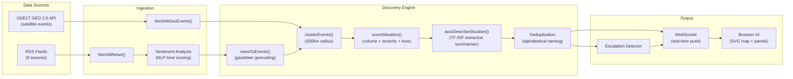
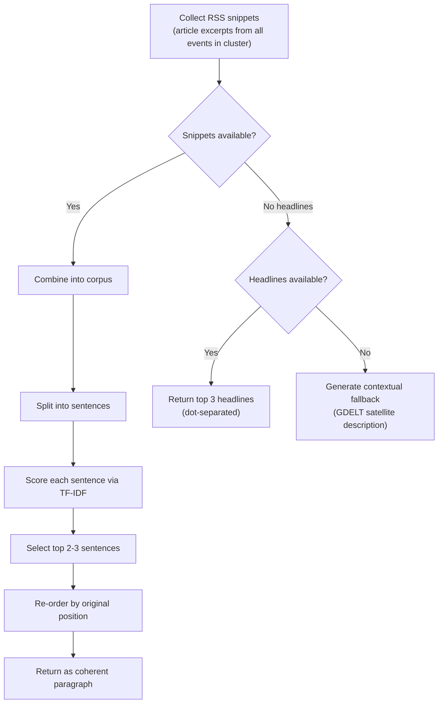

# Global Activity Monitor

A real-time geopolitical situation tracker that autonomously discovers, scores, and visualises active global events on an interactive world map. No hardcoded watchlists, no manual configuration. The system observes global data feeds, clusters events by geographic proximity, and surfaces the situations that matter.

---

## Why this exists

Most geopolitical dashboards are either paywalled intelligence platforms or glorified RSS readers with a map pinned on top. They either require you to tell them what to watch (keywords, regions, topic filters) or they dump raw feeds and call it "monitoring."

This project takes a different approach. It treats the problem the way an analyst would: ingest everything, cluster by geography, score by severity, and surface what's escalating. The system has no opinion about what you should care about. It discovers what is happening and ranks it. You decide what matters.

The underlying thesis is that a useful global monitor needs three properties:
1. **Autonomous discovery** -- it should find situations you did not anticipate.
2. **Quantified severity** -- "things are bad" is not actionable; a score on a defined scale is.
3. **Temporal awareness** -- escalation matters more than a static snapshot.

---

## Architecture

The system is a four-file Node.js application with a browser-based frontend. There is no database, no build step, no framework. State lives in memory and refreshes from live data on a cron cycle.

```
global-activity-monitor/
  server.js        -- Express + WebSocket server, cron scheduling, pipeline orchestration
  discovery.js     -- Situation discovery engine: gazetteer, clustering, scoring, summarisation
  feeds.js         -- RSS ingestion, sentiment analysis, deduplication
  index.html       -- Full frontend: SVG world map, side panel, notifications, news river
  package.json     -- 7 dependencies, nothing else
```

### Data flow



### Pipeline timing

| Stage | Frequency | Source |
|-------|-----------|--------|
| GDELT GEO scan | Every 10 minutes | 5 thematic queries, 75 events each, 2s delay between queries |
| RSS feed refresh | Every 5 minutes | 9 feeds fetched sequentially with 10s timeout per feed |
| Discovery pipeline | Triggered after each GDELT scan | Clusters all events, scores, deduplicates, pushes via WebSocket |
| Escalation check | Every discovery cycle | Compares current status against previous state map |

---

## How scoring works

Every discovered situation receives a score from 1.0 to 10.0 computed from three independent signals. This is not a black box -- the formula is deterministic and auditable.

### Score components

```
FINAL_SCORE = min(10, VOLUME + SEVERITY + TONE)
```

**1. Volume score (0 to 8 points)**

How heavily is this situation being reported? Raw function: `min(article_count / 4, 8)`.

| Articles in cluster | Volume score |
|---------------------|-------------|
| 4 | 1.0 |
| 8 | 2.0 |
| 16 | 4.0 |
| 32+ | 8.0 (cap) |

The divisor of 4 was chosen empirically. Most noise clusters have 2-3 events. Anything above 15 articles in 24 hours for a single geographic cluster is significant by any standard.

**2. Severity keyword score (0 to 3 points)**

The system scans all headlines in the cluster for escalation-indicative language, using three tiers:

| Tier | Score | Terms |
|------|-------|-------|
| Critical | 3 | war, killed, airstrike, bombing, massacre, genocide, invasion, missile, casualties, death toll, execution, shelling |
| Elevated | 2 | conflict, fighting, attack, troops, military, clash, violence, crisis, hostage, artillery, drone, refugee, displacement, humanitarian |
| Moderate | 1 | tension, sanctions, protest, unrest, dispute, threat, escalation, opposition, riot, detain, arrest |

Only the highest matching tier scores. This prevents double-counting a cluster that has both "war" and "protest" -- the critical tier dominates.

**3. Tone score (0 to 2 points)**

Derived from sentiment analysis of the news coverage. Two data sources feed this:

- **GDELT events**: GDELT provides a native tone score (-10 to +10) from their global content analysis.
- **RSS headlines**: Locally computed using the `sentiment` NLP package, normalised to the same -10 to +10 scale.

The conversion: `tone_score = min(2, max(0, -average_tone / 5))`. A perfectly neutral tone scores 0. Extremely negative coverage scores up to 2.

### Status classification

| Status | Score range | Colour |
|--------|-----------|--------|
| Critical | 6.5+ | Red |
| Elevated | 4.0 - 6.4 | Orange |
| Stable | Below 4.0 | Green |

### An honest assessment of this scoring model

It works well for high-signal situations (wars, active military operations, major crises) where volume and keyword severity align. It is weaker for slow-burn situations -- a diplomatic fallout that produces 3 carefully worded articles will score low despite being consequential. The tone component helps slightly but sentiment analysis on headlines is a blunt instrument. A future version would benefit from tracking score trends over time rather than relying on a single-cycle snapshot.

---

## Situation summarisation

The Situation field in the side panel is generated by an extractive summarisation engine built into the discovery pipeline. This is not an LLM or a generative model -- it is a deterministic TF-IDF sentence ranker that selects the most informative sentences from the available news coverage.

### How it works



The TF-IDF scoring works by computing term frequency (how often a word appears in a sentence) multiplied by inverse document frequency (how unique that word is across all sentences). Sentences with many rare, topic-specific words score higher than sentences full of common language. This consistently surfaces the most informative sentence in a cluster without requiring any external API calls.

### Fallback chain

1. **RSS snippets available**: Full extractive summary from article excerpts (best quality)
2. **Only headlines available**: Top 3 unique headlines joined by dots
3. **GDELT-only data**: Contextual description synthesised from satellite event metadata (military activity, border crossings, etc.)
4. **Nothing matches filters**: Generic monitoring statement with event count

---

## Data sources

### GDELT GEO 2.0

The [GDELT Project](https://www.gdeltproject.org/) monitors broadcast, print, and web news across the world in over 100 languages. The GEO 2.0 API returns geolocated events matching thematic queries. This project queries five themes every 10 minutes:

- Conflict (war, fighting, battle)
- Crisis (humanitarian, refugee, famine)
- Military (airstrike, troops, bombing)
- Unrest (protest, riot, uprising)
- Tension (sanctions, nuclear, standoff)

Each query returns up to 75 geolocated events with coordinates, article references, and tone scores. Events at (0, 0) are filtered as geocoding errors.

### RSS feeds

Nine RSS feeds are polled every 5 minutes:

| Source | Type | Notes |
|--------|------|-------|
| BBC World | Mainstream | Reliable, broad coverage |
| Al Jazeera | Mainstream | Strong Middle East and Global South coverage |
| Reuters | Wire service | Currently returning DNS errors (feed URL may have changed) |
| AP News | Wire service | Returns 403s intermittently (likely bot detection) |
| Counterpunch | Independent/Left | US foreign policy criticism, investigative |
| Declassified UK | Independent | UK foreign and military policy, FOIA-based |
| RT News | State-funded (Russia) | Included deliberately for perspective diversity, not as trusted source |
| Mint Press News | Independent | Middle East focus, critical of Western policy |
| The Grayzone | Independent | Investigative, adversarial to establishment narratives |

The source selection is intentionally heterogeneous. The scoring engine does not weight sources differently -- a BBC headline and an RT headline contribute equally to the volume and keyword scores. The rationale is that for a monitoring tool, detecting that a situation is being discussed across ideologically opposed outlets is itself a signal of significance.

---

## Clustering

Events are grouped using a single-pass greedy clustering algorithm with a 500km radius (haversine distance). This is not k-means or DBSCAN -- it is a much simpler approach:

1. For each incoming event, check if it falls within 500km of any existing cluster center.
2. If yes, add it to that cluster and update the center (rolling average).
3. If no, create a new cluster.
4. Discard clusters with fewer than 2 events (noise filtering).

The 500km radius was chosen to group events that belong to the same regional conflict without merging distinct situations. It correctly groups "Kyiv shelling" and "Kherson offensive" into a single Ukraine situation while keeping "Moldova political crisis" separate.

**Trade-off**: This radius is too wide for dense regions (the Levant) and too narrow for sprawling conflicts (the Sahel). A production system would use adaptive radii based on regional density.

### Naming

Situations are auto-named by extracting the two most-mentioned countries from the cluster's headlines, sorted alphabetically. "Ukraine - Russia" and "Russia - Ukraine" are always normalised to "Russia - Ukraine". When only GDELT geo-data is available (no country mentions in headlines), the nearest entry in the 127-country gazetteer is used.

---

## Escalation notifications

The system tracks the status of every discovered situation across discovery cycles. When a situation's status worsens (e.g., stable to elevated, elevated to critical), an escalation event fires.

### What happens on escalation

1. **Server side**: The `detectEscalations()` function compares current statuses against a `previousStates` map. Any upward movement triggers a WebSocket `escalation` message.
2. **Client side**:
   - The notification bell in the header lights up with a count badge
   - A pulsating animation plays on the bell
   - An auditory alert plays (two-tone ascending via Web Audio API)
   - A browser notification is dispatched (if permissions granted)
   - The relevant map dot flashes briefly
   - The escalation is logged in the notification dropdown with timestamp

The system only alerts on escalations, not de-escalations. A situation moving from critical to elevated does not trigger a notification. This is to prevent alert fatigue from situations that oscillate near a threshold boundary.

---

## Frontend

The frontend is a single `index.html` file containing 72KB of HTML, CSS, and JavaScript. No framework, no build tools, no transpilation. The map is an SVG-based Equirectangular projection rendered inline.

### Key UI components

- **SVG world map**: Country paths with pulsating activity dots coloured by status
- **Activity strip**: Horizontal scrollable bar of all discovered situations, sorted by severity
- **Side panel**: Full detail view with score breakdown, situation summary, parties involved, and related coverage links
- **News river**: Right-side feed showing the latest headlines from all RSS sources with source tags and tone scores
- **Notification bell**: Escalation alert system with dropdown history
- **Status bar**: Live counts of critical/elevated/stable situations and real-time clock

### Interaction model

- Click a dot on the map or a strip item to open the side panel
- Hover over a dot for a tooltip with name, type, and score
- Click a news item to open the source article in a new tab
- Click the bell to view/clear escalation history

---

## Running it

### Requirements

- Node.js 18+ (tested on 20.x and 22.x)
- An internet connection (GDELT API + RSS feeds are remote)
- No API keys required

### Setup

```bash
git clone https://github.com/YOUR_USERNAME/global-activity-monitor.git
cd global-activity-monitor
npm install
node server.js
```

Open `http://localhost:4000` in a browser. The first discovery cycle takes about 60 seconds (GDELT rate limiting introduces 2-second delays between theme queries). After the initial load, data refreshes automatically.

### Environment variables

| Variable | Default | Description |
|----------|---------|-------------|
| `PORT` | 4000 | Server port |

That is the only configurable parameter. Everything else is tuned in the source.

---

## Known limitations and candid notes

**No persistence.** State lives in memory. If the server restarts, all historical data is lost. A production version would need at minimum a SQLite store for situation history and score trends.

**No authentication.** This is a local tool. Exposing it to the internet without auth is inadvisable.

**GDELT rate limiting.** The 2-second delay between theme queries is defensive. GDELT does not document their rate limits precisely, so the system errs on the side of caution. This means a full scan takes ~40-60 seconds.

**RSS fallibility.** Reuters and AP feeds frequently return errors (DNS failures, 403s). The system logs these and continues. Losing two feeds out of nine does not meaningfully degrade coverage for most situations, but it does create blind spots for wire-service-exclusive stories.

**Sentiment analysis is shallow.** The `sentiment` package does bag-of-words analysis. It does not understand sarcasm, context, or negation well. A headline like "Peace talks collapse" might score mildly negative when a human would read it as alarming. The GDELT tone scores are more sophisticated but are only available for satellite events, not RSS headlines.

**Clustering is naive.** The greedy single-pass approach has known failure modes: insertion order affects cluster assignment, and the rolling center average can drift if early events are outliers. For the scale of data this system processes (~500 events per cycle), these edge cases rarely manifest.

**No historical tracking.** The system shows a 24-hour snapshot. It cannot answer "is this situation getting worse over the past week?" Future work would involve persisting scores and computing trend lines.

---

## Dependencies

| Package | Purpose | Why this one |
|---------|---------|-------------|
| `express` | HTTP server | Industry standard, minimal footprint |
| `ws` | WebSocket server | Lightweight, no Socket.io overhead |
| `node-cron` | Scheduled tasks | Simple cron syntax for polling intervals |
| `rss-parser` | RSS feed parsing | Handles RSS 2.0 and Atom, 10s timeout |
| `sentiment` | NLP tone scoring | Zero-dependency, bag-of-words, fast |
| `node-summarizer` | TextRank reference | Installed but the extractive summariser is custom-built using TF-IDF directly in `discovery.js` |
| `cors` | Cross-origin headers | Allows local development from different ports |

Total `node_modules` footprint is under 5MB. There are no native bindings, no C++ compilation steps, and no transitive dependency nightmares.

---

## File-by-file breakdown

### `server.js` (369 lines)

The orchestration layer. Handles:
- Express server setup and static file serving
- WebSocket connection management and message broadcasting
- GDELT GEO API fetching (sequential with rate-limiting delays)
- News-to-events conversion (geocoding headlines via the gazetteer)
- Discovery pipeline execution (calls into `discovery.js`)
- Escalation detection (state comparison across cycles)
- Cron scheduling (10-min discovery scans, 5-min news refreshes)

### `discovery.js` (689 lines)

The analytical core. Contains:
- **Gazetteer**: 127 countries/territories with coordinates and 400+ aliases for location extraction
- **Location extraction**: Regex-based entity recognition with word boundary matching
- **GDELT parsing**: GeoJSON response normalisation with HTML tag stripping
- **Clustering**: Haversine-distance greedy clustering (500km radius)
- **Auto-naming**: Country extraction + alphabetical normalisation
- **Scoring**: Three-component severity formula (volume + keywords + tone)
- **Categorisation**: 12 category patterns (War, Armed Conflict, Terrorism, Maritime Dispute, etc.)
- **Summarisation**: TF-IDF extractive summariser with sentence scoring and positional re-ordering
- **Party extraction**: Top 4 countries mentioned across cluster headlines

### `feeds.js` (117 lines)

RSS ingestion. Fetches 9 feeds, runs each headline through `sentiment` for tone scoring, deduplicates by title similarity, and returns normalised news items with title, link, source, snippet, tone, and timestamp.

### `index.html` (1939 lines)

The entire frontend in a single file. Contains inline CSS, an SVG world map with country paths, and JavaScript for:
- WebSocket connection and message handling
- Map rendering with pulsating activity dots
- Side panel with full situation breakdowns
- Activity strip (horizontal scrollbar of situations)
- News river (real-time feed display)
- Notification bell with escalation history
- Alert sounds via Web Audio API
- Browser notification integration

---

## License

MIT
