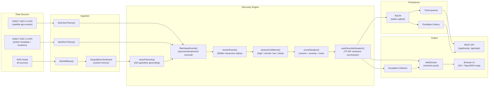
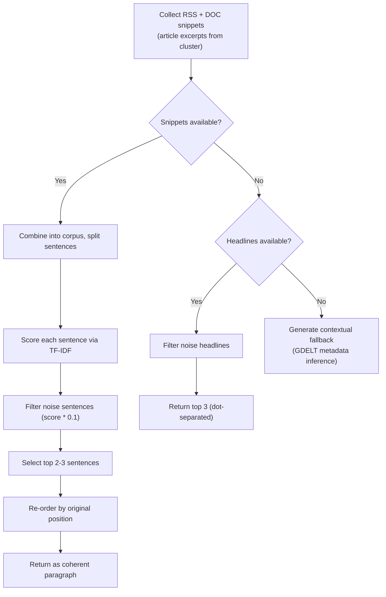

# Global Activity Monitor

A real-time geopolitical situation tracker that autonomously discovers, scores, and visualises active global events on an interactive world map. No hardcoded watchlists, no manual configuration. The system observes global data feeds, clusters events by geographic proximity, and surfaces the situations that matter.

---

## Why this exists

Most geopolitical dashboards are either paywalled intelligence platforms or glorified RSS readers with a map pinned on top. They either require you to tell them what to watch (keywords, regions, topic filters) or they dump raw feeds and call it "monitoring."

This project takes a different approach. It treats the problem the way an analyst would: ingest everything, cluster by geography, score by severity, and surface what's escalating. The system has no opinion about what you should care about. It discovers what is happening and ranks it. You decide what matters.

The underlying thesis is that a useful global monitor needs three properties:
1. **Autonomous discovery** -- it should find situations you did not anticipate.
2. **Quantified severity** -- "things are bad" is not actionable; a score on a defined scale is.
3. **Temporal awareness** -- escalation matters more than a static snapshot.

---

## Architecture

The system is a six-file Node.js application with a browser-based frontend. SQLite persists situation history across restarts. No build step, no framework beyond Express.

```
global-activity-monitor/
  server.js           -- Express + WebSocket server, cron scheduling, pipeline orchestration, auth
  discovery.js        -- Situation discovery engine: clustering, scoring, summarisation, noise filter
  countries-data.js   -- ISO 3166-1 standard geodata: 150+ countries with coordinates, capitals, aliases
  feeds.js            -- RSS ingestion, geopolitical sentiment lexicon, deduplication
  db.js               -- SQLite persistence layer: situation snapshots, articles, escalation history
  index.html          -- Frontend: D3.js + TopoJSON world map, side panel, notifications, news river
  package.json        -- 7 dependencies
  .env.example        -- Environment variable reference
  ARCHITECTURE_PLAN.md -- Hardcoding audit and improvement roadmap
```

### Data flow



### Pipeline timing

| Stage | Frequency | Detail |
|-------|-----------|--------|
| GDELT GEO scan | Every 10 min | 5 thematic queries, 75 events each, 2.2s delay between queries |
| GDELT DOC scan | Every 10 min | First 3 themes, interleaved with GEO queries (rate budget) |
| RSS feed refresh | Every 5 min | 9 feeds fetched sequentially, 10s timeout per feed |
| Discovery pipeline | After each GDELT scan | Cluster, score, persist, push via WebSocket |
| DB cleanup | Daily at 03:00 | Removes data older than 30 days |

---

## How scoring works

Every discovered situation receives a score from 1.0 to 10.0 computed from three independent signals. The formula is deterministic and auditable.

### Score components

```
FINAL_SCORE = min(10, VOLUME + SEVERITY + TONE)
```

**1. Volume score (0 to 8 points)**

How heavily is this situation being reported? RSS and DOC articles are weighted 1.5x compared to raw GDELT geo-events (0.5x each), reflecting the difference in signal quality.

| Effective article count | Volume score |
|------------------------|-------------|
| 4 | ~2.0 |
| 8 | ~4.0 |
| 16+ | 8.0 (cap) |

**2. Severity keyword score (0 to 3 points)**

Scans headlines for escalation-indicative language in three tiers:

| Tier | Score | Examples |
|------|-------|---------|
| Critical | 3 | war, killed, airstrike, bombing, massacre, genocide, invasion, missile, casualties, death toll |
| Elevated | 2 | conflict, fighting, attack, troops, military, clash, violence, crisis, hostage, artillery, drone, refugee |
| Moderate | 1 | tension, sanctions, protest, unrest, dispute, threat, escalation, riot, detain, arrest |

Only the highest matching tier scores. Headlines from RSS/DOC sources are prioritised over GDELT geo-event names.

**3. Tone score (0 to 2 points)**

Derived from sentiment analysis. Two separate pipelines feed this:

- **GDELT events**: GDELT provides a native tone score computed by their production NLP pipeline.
- **RSS headlines**: Locally computed using a **custom geopolitical sentiment lexicon** (120+ terms) that overrides the base AFINN dictionary. This fixes chronic misscoring of conflict language -- "strike" scores -4 instead of AFINN's -1, "ceasefire" scores +2 instead of 0, "casualties" scores -5 instead of -2.

The conversion: `tone_score = min(2, max(0, -average_tone / 5))`.

### Confidence tiers

New in v3: situations are assigned a confidence level based on source diversity, which directly affects scoring:

| Confidence | Condition | Effect |
|------------|-----------|--------|
| **high** | 3+ RSS or DOC articles | Full scoring |
| **normal** | 1+ RSS or DOC article | Full scoring |
| **low** | Only GDELT geo-events (8+) | Score capped at 3.9 |
| **noise** | Too few events, no articles | Discarded entirely |

Low-confidence situations appear as dashed, dimmed dots on the map. They cannot reach elevated or critical status until confirmed by article coverage. This prevents GDELT satellite noise from generating false alarms.

### Status classification

| Status | Score range | Colour |
|--------|-----------|--------|
| Critical | 6.5+ | Red |
| Elevated | 4.0 - 6.4 | Orange |
| Stable | Below 4.0 | Green |

### An honest assessment

The scoring model works well for high-signal situations where volume, keyword severity, and tone align. The confidence system meaningfully reduces false positives from GDELT-only data. Weaknesses remain: slow-burn diplomatic situations that produce few articles score low despite being consequential. The severity keywords are still a hardcoded list -- the `ARCHITECTURE_PLAN.md` documents the path toward replacing them with GDELT CAMEO event codes, which would be data-driven rather than hand-maintained.

---

## Noise filtering

Sports, entertainment, and other non-geopolitical content is filtered before clustering. The filter uses a two-tier approach:

- **Strong terms** (>7 characters): A single match like "championship" or "tournament" triggers noise classification, unless 2+ geopolitical severity terms are also present (handles cases like "Olympic boycott").
- **Weak terms** (<=7 characters): Requires 3+ simultaneous matches to trigger (avoids false positives on short ambiguous words).

The `ARCHITECTURE_PLAN.md` documents an improvement path where GDELT CAMEO codes replace keyword lists entirely -- events with CAMEO codes are geopolitical by definition, no filter needed.

---

## Situation summarisation

The Situation field in the side panel is generated by an extractive summarisation engine. This is not an LLM -- it is a deterministic TF-IDF sentence ranker that selects the most informative sentences from available news coverage.

### How it works



The TF-IDF scoring computes term frequency multiplied by inverse document frequency. Sentences with rare, topic-specific words score higher than generic language. Sentences that match the noise filter have their score reduced by 90%. This runs entirely locally with zero external API calls.

---

## Geopolitical sentiment lexicon

The default AFINN sentiment dictionary was built for product reviews and social media. It systematically underweights conflict language. The custom `GEO_LEXICON` in `feeds.js` overrides 120+ terms:

| Term | AFINN default | Geopolitical override | Rationale |
|------|--------------|----------------------|-----------|
| strike | -1 | -4 | AFINN treats this as a labor dispute. In geopolitics, it means airstrike. |
| collapse | -2 | -4 | "Government collapse" is not mildly negative. |
| casualties | -2 | -5 | Any headline mentioning casualties is severe. |
| ceasefire | 0 | +2 | AFINN has no entry. A ceasefire is positive in conflict monitoring. |
| invasion | 0 | -5 | AFINN has no entry. |

The lexicon also scores de-escalation terms positively (ceasefire +2, peace talks +3, reconciliation +3) so the tone component correctly reflects improving situations, not just worsening ones.

---

## Data sources

### GDELT GEO 2.0

Returns geolocated events matching thematic queries. Five themes queried every 10 minutes:

- Conflict (war, fighting, battle)
- Crisis (humanitarian, refugee, famine)
- Military (airstrike, troops, bombing)
- Unrest (protest, riot, uprising)
- Tension (sanctions, nuclear, standoff)

Each query returns up to 75 geolocated events with coordinates, article references, and tone scores.

### GDELT DOC 2.0 (new in v3)

Returns actual articles with pre-extracted metadata. The first 3 themes are also queried via the DOC API, which provides:
- Article titles and URLs
- Source country and language
- Domain information
- Pre-extracted country mentions (used for geocoding)

DOC results are interleaved with GEO queries to stay within GDELT's rate budget.

### RSS feeds

Nine feeds polled every 5 minutes:

| Source | Type | Notes |
|--------|------|-------|
| BBC World | Mainstream | Reliable, broad coverage |
| Al Jazeera | Mainstream | Strong Middle East and Global South coverage |
| Reuters | Wire service | Intermittent DNS errors |
| AP News | Wire service | Intermittent 403s |
| Counterpunch | Independent/Left | US foreign policy criticism, investigative |
| Declassified UK | Independent | UK foreign and military policy, FOIA-based |
| RT News | State-funded (Russia) | Included for perspective diversity |
| Mint Press News | Independent | Middle East focus |
| The Grayzone | Independent | Investigative, adversarial to establishment narratives |

The source selection is intentionally heterogeneous. The scoring engine does not weight sources differently. Detecting that a situation is discussed across ideologically opposed outlets is itself a signal of significance.

---

## Persistence (new in v3)

SQLite (via `better-sqlite3`) stores situation history, articles, and escalation events. The database enables:

### What is persisted

| Table | Contents | Retention |
|-------|----------|-----------|
| `snapshots` | Full situation state per discovery cycle | 30 days |
| `articles` | Top articles linked to each situation | 30 days |
| `escalations` | Status change events with timestamps | 30 days |

### APIs powered by persistence

| Endpoint | Purpose |
|----------|---------|
| `GET /api/trends?hours=24` | All situations with score direction (up/down/stable) and delta |
| `GET /api/trends/:name?days=7` | Score history for a specific situation (for trend lines) |
| `GET /api/escalations?limit=50` | Chronological escalation history |
| `GET /api/stats` | Database statistics (snapshot count, article count, DB size) |
| `GET /api/health` | Server uptime, activity count, DB status |

### State recovery

On restart, the server recovers the `previousStates` map from the most recent snapshot. This means escalation detection works correctly across server restarts -- no data loss, no false re-escalations.

---

## Authentication (new in v3)

Optional HTTP Basic Auth, controlled by environment variables:

```bash
AUTH_PASSWORD=your_secret_here
AUTH_USER=monitor    # defaults to "monitor"
```

When `AUTH_PASSWORD` is set:
- All HTTP endpoints require Basic Auth (except `/api/health`)
- WebSocket connections require either Basic Auth headers or a `?token=` query parameter
- The login prompt appears automatically in browsers

When `AUTH_PASSWORD` is unset (default), authentication is disabled entirely.

---

## Clustering

Events are grouped using a single-pass greedy algorithm with a 500km Haversine radius:

1. For each incoming event, check if it falls within 500km of any existing cluster center.
2. If yes, add it and update the center (rolling average).
3. If no, create a new cluster.
4. Discard clusters with fewer than 2 events.

### Naming

Situations are auto-named by extracting the two most-mentioned countries from the cluster's headlines, sorted alphabetically. When only GDELT geo-data is available, the nearest entry in the `countries-data.js` ISO gazetteer is used via `findNearest()`.

### Limitation

The 500km radius is too wide for dense regions (the Levant) and too narrow for sprawling conflicts (the Sahel). The `ARCHITECTURE_PLAN.md` documents a path toward density-adaptive clustering and country-pair-based grouping.

---

## Country data (`countries-data.js`)

Replaces the v2 hand-maintained gazetteer with ISO 3166-1 standard data. 150+ countries with:
- ISO alpha-2 codes
- Representative coordinates (capital city)
- Major cities (for sub-national matching)
- Official abbreviations (UK, US, UAE, etc.)

A fast lookup index is built at load time from the structured data, rather than maintaining a separate lookup table. The `extractCountries()` function uses word-boundary regex matching against country names, capitals, cities, and abbreviations.

---

## Frontend

The frontend is a single `index.html` file. No framework, no build tools.

### D3.js + TopoJSON map (new in v3)

Replaces the v2 hand-drawn SVG continent blobs with a real world map:
- **Natural Earth 1 projection** -- good balance of area and shape distortion
- **Natural Earth 110m TopoJSON** loaded from CDN (~100KB)
- **Country hover** -- highlights country boundaries and shows name
- **ISO 3166-1 numeric mapping** built into the frontend for labeling features
- **Activity dots** sized and styled by confidence (low-confidence dots are smaller and dimmer)
- **Connection lines** between nearby non-stable situations

### Key UI components

- **SVG world map**: D3-rendered country paths with pulsating activity dots
- **Confidence indicators**: Dashed borders and dimmed dots for low-confidence (satellite-only) situations
- **Activity strip**: Scrollable sidebar list sorted by severity, low-confidence items visually distinguished
- **Side panel**: Score breakdown, confidence badge, situation summary, related coverage with tone scores
- **News river**: Right-side feed with source tags
- **Notification bell**: Escalation alerts with audio (Web Audio API) and browser notifications
- **Status bar**: Live counts + UTC clock

---

## Running it

### Requirements

- Node.js 18+ (tested on 20.x and 22.x)
- Internet connection (GDELT API + RSS feeds are remote)
- No API keys required

### Setup

```bash
git clone https://github.com/ashioyajotham/global-activity-monitor.git
cd global-activity-monitor
npm install
node server.js
```

Open `http://localhost:4000`. The first discovery cycle takes about 60 seconds (GDELT rate limiting). Data refreshes automatically after that.

### Environment variables

| Variable | Default | Description |
|----------|---------|-------------|
| `PORT` | 4000 | Server port |
| `AUTH_PASSWORD` | _(empty)_ | Set to enable Basic Auth |
| `AUTH_USER` | monitor | Username for Basic Auth |
| `DB_PATH` | ./monitor.db | SQLite database file path |

### Database management

```bash
# Manual cleanup (keep last 30 days)
npm run cleanup

# Check health
curl http://localhost:4000/api/health

# View trends
curl http://localhost:4000/api/trends?hours=24

# View specific situation history
curl http://localhost:4000/api/trends/Iran%20-%20United%20States?days=7
```

---

## Known limitations

**Keyword-based classification.** Severity scoring and noise filtering still use hardcoded term lists. The `ARCHITECTURE_PLAN.md` documents the path toward GDELT CAMEO event codes, which would replace keyword guessing with structured classification data.

**Fixed cluster radius.** 500km is too wide for the Levant, too narrow for Russia. Density-adaptive or country-pair clustering would be more accurate.

**Static score thresholds.** 6.5/4.0 do not adapt to global baseline. On a quiet day, nothing hits critical. On a crisis day, everything does. Percentile-based thresholds would self-calibrate.

**English-language bias.** All 9 RSS feeds are English. The GDELT DOC API partially compensates (it indexes 150+ countries in all languages), but article snippets used for summarisation are English-only.

**Sentiment is still bag-of-words.** The custom lexicon improves on AFINN but cannot handle negation ("no casualties reported" still scores negative) or sarcasm. GDELT's production tone scores are more sophisticated but only available for GDELT-sourced events.

**No authentication by default.** Exposing to the internet without setting `AUTH_PASSWORD` is inadvisable.

**GDELT rate limits.** The 2.2s delay between requests is conservative. Interleaving GEO and DOC queries doubles the useful data but also doubles scan time to ~50-70 seconds per cycle.

---

## Dependencies

| Package | Purpose | Why this one |
|---------|---------|-------------|
| `express` | HTTP server | Standard, minimal |
| `ws` | WebSocket server | Lightweight, no Socket.io overhead |
| `better-sqlite3` | SQLite persistence | Synchronous API (no async complexity), zero-config, fast |
| `node-cron` | Scheduled tasks | Simple cron syntax |
| `rss-parser` | RSS feed parsing | Handles RSS 2.0 and Atom |
| `sentiment` | NLP tone baseline | Zero-dependency, extended with custom lexicon |
| `cors` | Cross-origin headers | Local development support |

Frontend dependencies loaded from CDN (no node_modules):
- `d3` v7.9.0 -- map projection and rendering
- `topojson-client` v3.0.2 -- TopoJSON feature extraction

---

## File-by-file breakdown

### `server.js` (254 lines)

Orchestration layer. Express server, WebSocket management, GDELT GEO + DOC fetchers (interleaved with rate-limiting), news-to-events geocoding, discovery pipeline execution, escalation detection with state recovery, basic auth middleware, REST API endpoints for trends/stats/health, cron scheduling, graceful shutdown.

### `discovery.js` (306 lines)

Analytical core. Noise classification and filtering, GDELT GEO/DOC response parsing, haversine clustering, confidence assessment, auto-naming (country extraction + alphabetical normalisation), TF-IDF extractive summarisation with noise sentence demotion, 12-category classification, three-component severity scoring with confidence caps, party extraction, deduplication.

### `countries-data.js` (347 lines)

ISO 3166-1 standard country data. 150+ countries with coordinates, capitals, major cities, and official abbreviations. Fast lookup index built at load time. `extractCountries()` for headline geocoding, `findNearest()` for reverse geocoding GDELT coordinates.

### `feeds.js` (259 lines)

RSS ingestion with enhanced sentiment. 120+ term geopolitical lexicon overriding AFINN defaults. Fetches 9 feeds, runs enhanced tone analysis, deduplicates by title similarity. Exports `analyzeGeopoliticalTone()` and `GEO_LEXICON` for transparency.

### `db.js` (294 lines)

SQLite persistence via `better-sqlite3`. Schema: `snapshots`, `articles`, `escalations` tables. Write operations: `storeSituations()`, `storeArticles()`, `storeEscalation()`. Trend queries: `getScoreTrend()`, `getAllTrends()`. State recovery: `recoverPreviousStates()`. Maintenance: `cleanup()` with configurable retention.

### `index.html` (561 lines)

Complete frontend. D3.js Natural Earth projection, TopoJSON country rendering with ISO 3166-1 labeling, confidence-aware dot sizing, connection lines between proximate situations, activity strip with confidence styling, side panel with score + confidence breakdown, news river, notification bell with Web Audio alerts, responsive layout.

### `ARCHITECTURE_PLAN.md` (345 lines)

Hardcoding audit documenting 12 categories of brittle keyword lists in the codebase, with concrete alternatives for each. Proposes a 3-wave improvement path: Wave 1 (map + DOC API, completed), Wave 2 (CAMEO codes replace keyword lists), Wave 3 (adaptive clustering + percentile thresholds).

---

## Roadmap

The `ARCHITECTURE_PLAN.md` contains the full technical audit. Summary of what is done and what remains:

| Wave | Status | Description |
|------|--------|-------------|
| Wave 1 | Done | Real TopoJSON map, GDELT DOC API, ISO country data, SQLite persistence |
| Wave 2 | Planned | CAMEO event codes replace severity keywords and category patterns |
| Wave 3 | Planned | Density-adaptive clustering, percentile-based score thresholds, source diversity scoring |

---

## License

MIT
